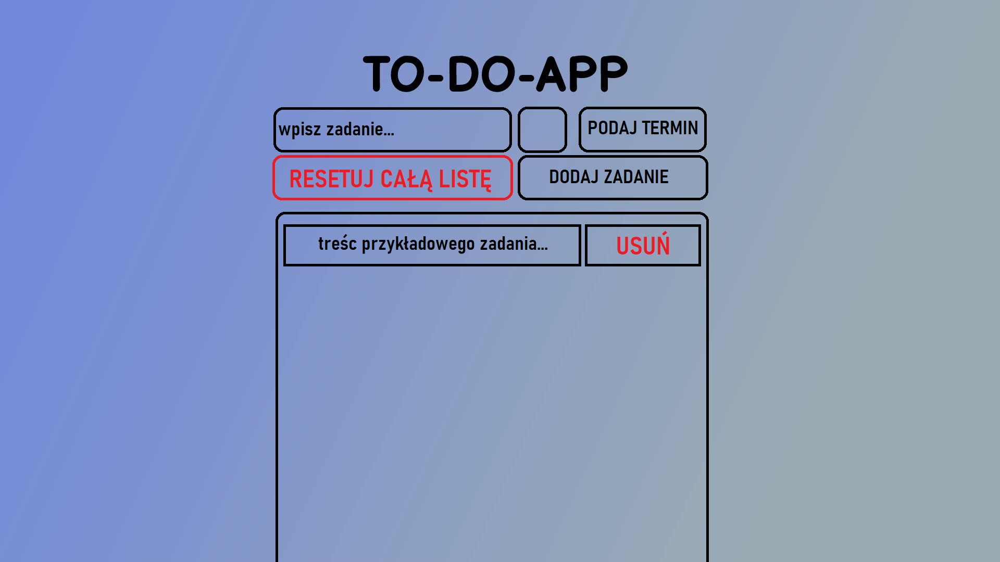

# Projekt
## Wczesny podgląd wyglądu aplikacji
_wygląd aplikacji może ulegać zmianie wraz z nauką osoby tworzącej ją, jest to wczesny podgląd mający dać ogólne obeznanie co do jej działania._

1. Celem pracy jest opracowanie interaktywnej aplikacji internetowej, która ma za zadanie wyręczyć użytkownika w obowiązkach zapamiętywania swoich codziennych(bądź nie) zadań. Aplikacja została zaprojektowana w formie witryny internetowej 

1. Pole - wpisz zadanie
    - Pole te będzie odpowiedzialne za możliwość wpisania zadania z klawiatury przez użytkownika
1. Pole bez tekstsu
    - Pole te będzie dawało użytkownikowi możliwość ustawienia zadania jako priorytetowe, co spowoduje podświetlenie go na czerwono
1. Pole - PODAJ TERMIN
    - Pole te będzie dawało użytkownikowi możliwość podania daty do jakiej dane zadanie ma zostać wykonane
1. Przycisk - RESETUJ CAŁĄ LISTĘ
    - Przycisk ten powinien pojawić się po dodaniu przez użytkownika zadania, będzie ono odpowiedzialne za wyczyszczenie z zadań całej listy użytkownika
1. Przycisk - DODAJ ZADANIE
    - Przycisk ten umożliwi użytkownikowi dodanie do listy wcześniej wpisanego zadania. 
1. Przycisk - USUŃ 
    - Przycisk ten pojawić powinien się równocześnie z dodaniem przez użytkownika zadania, umożliwi on użytkownikowi na usunięcie danego zadania w liście.